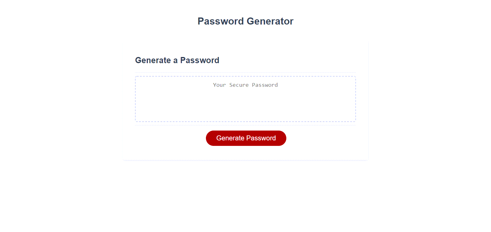

# Password Generator Starter Code

**Description**   
This is a password generator that will provide a password in the length the user determines and include the character types the user decides to include. The length of the password is limited to be between 8 and 128 characters. The user is prompted if they would like to include upper case letters, lower case letters, numbers and/or special characters. Once the user answers each prompt they will be given a unique password on the screen that is tailored to their responses, which they can copy and use where they need to. 

**Website Layout**

**Website Link**

https://kimberlyamaya.github.io/Password-Generator/

**Logic in Password Generator**
* Once the Generate Password button is pressed this sets off a series of prompts  
* The user is prompted for length of password between 8 and 128 characters  
    * if a value between 8 and 128 (including numbers 8 and 128) are enterd, then the user will be directed to the next prompt  
    * if a value smaller than 8, including 0 is entered a new prompt is displayed and will instruct the user to try agian  
    * if a value larger than 128 is entered a new prompt is displayed and will instruct the user to try agian  
    * if a blank value and/or non integer value is entered a new prompt is displayed and will instruct the user try again  
* The user is prompted if they would like to include uppercase letters in their password  
* The user is prompted if they would like to include lowercse letters in their password  
* The user is prompted if they would like to include numbers in their password  
* The user is prompted if they would like to include speical characters in their password  
* I gather the true/false values from the last 4 window confirms and assign a character set to each true/false combination possible 
* Once the character set is assigned I follow the character length given and a unique random password is displayed on the screen

**Editors**  
* Starter code was provided by UC Davis Boot Camp via GitHub
* Kimberly Amaya added the logic to make the password generate
